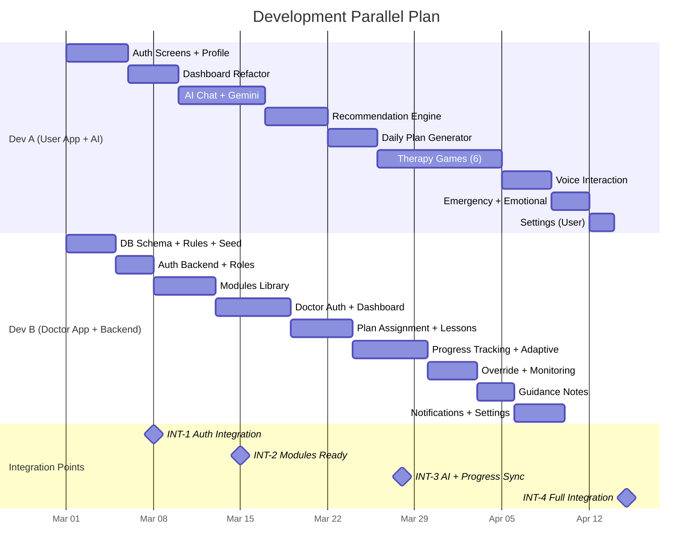

# CARE-AI — Comprehensive Development Plan

> **Generated from**: [prd.md](file:///d:/project%202/Ai-help/doc/prd.md) · [techstack.md](file:///d:/project%202/Ai-help/doc/techstack.md)
> **Tech Stack**: Flutter (Dart) · Firebase (Auth, Firestore, Cloud Functions, Cloud Storage, FCM) · Google Gemini AI
> **Team Size**: 2 Developers

---

## 1) PROJECT OVERVIEW

### Brief Summary

CARE-AI is a mobile application for parents/caregivers of children with developmental or physical disabilities. It combines **expert-designed therapy content**, **AI-driven personalization** (Google Gemini), and a **doctor/therapist oversight portal** into two application streams:

| Stream | Users | Purpose |
|---|---|---|
| **User App** (Patient Side) | Parents, caregivers, children | Daily therapy activities, AI chat, progress tracking, games |
| **Doctor App** | Therapists, pediatric specialists | Review child data, assign plans, create lessons, send guidance |

### Key Goals

1. Affordable, home-based therapy intervention
2. Structured daily guidance driven by AI + expert content
3. Progress tracking with adaptive difficulty
4. Professional oversight without in-person visits
5. Emotional support for parents/caregivers

### Main Components

| Component | Technology |
|---|---|
| Mobile Apps (2 streams) | Flutter / Dart |
| Authentication | Firebase Auth (Email, Phone OTP, Google) |
| Database | Cloud Firestore |
| Server Logic | Firebase Cloud Functions |
| File Storage | Firebase Cloud Storage |
| Push Notifications | Firebase Cloud Messaging |
| AI Chat & Recommendations | Google Gemini (Live, Vision, Video) |
| Voice I/O | STT/TTS Flutter plugins + Gemini Live |
| Image/Video Analysis | Gemini Vision + frame extraction |

### Existing Codebase (Already Built)

The project already has foundational files in `lib/`:

- **Auth**: `login_screen.dart`, `signup_screen.dart`
- **Home**: `home_screen.dart`
- **Chat**: `chat_screen.dart`
- **Profile**: `profile_setup_screen.dart`
- **Models**: `user_model.dart`, `child_profile_model.dart`, `chat_message_model.dart`
- **Services**: `ai_service.dart`, `firebase_service.dart`, `tts_service.dart`
- **Core**: `app_colors.dart`, `app_strings.dart`, `app_theme.dart`, `validators.dart`
- **Widgets**: `custom_button.dart`, `custom_text_field.dart`, `loading_indicator.dart`

> [!NOTE]
> The plan below accounts for extending/refactoring these existing files and adding all new modules required by the PRD.

---

## 2) USER APP STREAM (PATIENT SIDE)

---

### 2.1 User Authentication (PRD §7.1)

**Description**: Secure sign-up/login with Email, Phone OTP, and Google Sign-In; password recovery.

**Screens / UI Components**:
- Onboarding carousel (first launch)
- Login screen (existing `login_screen.dart` — extend)
- Signup screen (existing `signup_screen.dart` — extend)
- Password reset screen (NEW)
- Phone OTP verification screen (NEW)

**User Flows**:
1. First launch → Onboarding → Signup → Child Profile Setup → Dashboard
2. Return user → Login → Dashboard
3. Forgot password → Email reset link → Login
4. Phone OTP → Enter number → Verify code → Dashboard

**Frontend Tasks**:
- [ ] Build onboarding carousel with 3-4 slides
- [ ] Extend `login_screen.dart` with Google Sign-In and Phone OTP buttons
- [ ] Extend `signup_screen.dart` with Google Sign-In and Phone OTP flows
- [ ] Build `password_reset_screen.dart`
- [ ] Build `phone_otp_screen.dart`
- [ ] Add form validation using existing `validators.dart`

**Backend Tasks**:
- [ ] Configure Firebase Auth providers (Email, Phone, Google)
- [ ] Cloud Function: `onUserCreated` — initialize Firestore user document
- [ ] Cloud Function: `onUserDeleted` — cleanup all user data

**Database Requirements**:
- `users/{uid}` — `{ email, displayName, role: "parent", createdAt, lastLoginAt, fcmToken }`

**API Requirements**:
- Firebase Auth SDK (client-side)
- Cloud Function triggers (onCreate, onDelete)

**Integrations**: Firebase Auth, Google Sign-In plugin

**Edge Cases / Validation**:
- Duplicate email handling
- Invalid phone number format
- Network failure during OTP verification
- Account linking (email user signs in later with Google)

**Dependencies**: Firebase project setup, google-services.json/GoogleService-Info.plist

---

### 2.2 Child Profile Setup (PRD §7.2, §17.1)

**Description**: Collect comprehensive child data for AI personalization.

**Screens / UI Components**:
- Multi-step profile wizard (NEW: `child_profile_wizard.dart`)
- Edit profile screen
- Profile card widget (summary view on dashboard)

**User Flows**:
1. Post-signup → Step 1: Basic info → Step 2: Conditions → Step 3: Communication & behavior → Step 4: Goals → Review & Save
2. Dashboard → Edit child profile → Update any fields

**Frontend Tasks**:
- [ ] Build multi-step wizard with progress indicator
- [ ] Condition multi-select (ASD, ADHD, speech delays, cerebral palsy, Down syndrome, learning disabilities, sensory processing)
- [ ] Communication level selector (verbal / non-verbal / limited verbal)
- [ ] Behavioral concerns multi-select with free-text
- [ ] Sensory issues checklist
- [ ] Motor skill challenge level selector
- [ ] Parent goals input (multi-select + custom text)
- [ ] Current therapy status input
- [ ] Extend existing `child_profile_model.dart` with all fields

**Backend Tasks**:
- [ ] Cloud Function: validate child profile completeness
- [ ] Firestore security rules for child profile read/write by parent

**Database Requirements**:
- `users/{uid}/children/{childId}` — all fields from PRD §7.2 and §17.1

**API Requirements**: Firestore CRUD operations (client-side SDK)

**Integrations**: None external

**Edge Cases / Validation**:
- At least one condition must be selected
- Age must be a valid positive number
- Name required, gender optional
- Support for multiple children per parent

**Dependencies**: User Authentication (2.1)

---

### 2.3 Smart Dashboard (PRD §23, §22.3)

**Description**: Central hub showing today's activities, progress, recommendations, alerts, and quick-access AI assistant + emergency button.

**Screens / UI Components**:
- Parent Dashboard (refactor existing `home_screen.dart`)
  - Today's activity cards
  - Progress summary ring/bar
  - Recommended next steps section
  - Alert/reminder banner
  - Quick-access AI chat FAB
  - Emergency meltdown button (always visible)
  - Child profile card

**User Flows**:
1. Login → Dashboard → Tap activity card → Activity detail
2. Dashboard → Tap progress summary → Progress screen
3. Dashboard → Tap emergency button → Meltdown mode
4. Dashboard → FAB → AI Chat

**Frontend Tasks**:
- [ ] Refactor `home_screen.dart` to include all dashboard widgets
- [ ] Build `dashboard_activity_card.dart` widget
- [ ] Build `progress_summary_widget.dart`
- [ ] Build `recommendation_card.dart`
- [ ] Build `alert_banner.dart`
- [ ] Emergency meltdown FAB (persistent, high-contrast)
- [ ] Dynamic dashboard personalization based on usage patterns

**Backend Tasks**:
- [ ] Cloud Function: `getDashboardData` — aggregates today's plan, progress, recommendations
- [ ] Cloud Function: `getRecommendations` — calls Gemini AI for personalized next steps

**Database Requirements**:
- Reads from: daily plans, progress logs, recommendations, alerts

**API Requirements**:
- `GET /dashboard/{uid}/{childId}` (Cloud Function callable)

**Integrations**: AI Recommendation Engine (2.5)

**Edge Cases / Validation**:
- Empty state (first day, no activities yet)
- Multiple children — child selector
- Loading/error states for each section

**Dependencies**: Child Profile (2.2), Daily Plan (2.6), Progress Tracking (2.9)

---

### 2.4 AI Chat Assistant (PRD §7.6, §5)

**Description**: Natural language AI chat using Gemini Live model for parenting guidance, activity explanations, emotional encouragement. Non-diagnostic only.

**Screens / UI Components**:
- Chat screen (refactor existing `chat_screen.dart`)
  - Message bubbles (user/AI)
  - Typing indicator
  - Voice input button
  - Voice output toggle
  - Safety disclaimer banner
  - Suggested prompts/quick replies

**User Flows**:
1. Dashboard FAB → Chat → Type or voice message → AI responds (text + optional voice)
2. Activity screen → "Ask AI about this" → Context-aware chat

**Frontend Tasks**:
- [ ] Refactor `chat_screen.dart` with Gemini Live streaming support
- [ ] Implement message streaming (real-time token display)
- [ ] Build `chat_bubble.dart` with markdown rendering
- [ ] Add voice input button (STT)
- [ ] Add voice output toggle (TTS on responses)
- [ ] Suggested prompts carousel
- [ ] Non-diagnostic safety disclaimer (always visible)
- [ ] Persist chat history locally + Firestore

**Backend Tasks**:
- [ ] Cloud Function: `chatWithAI` — proxy to Gemini, inject system prompt with child context
- [ ] System prompt engineering: include child profile, recent progress, safety guardrails
- [ ] Rate limiting per user
- [ ] Chat history storage

**Database Requirements**:
- `users/{uid}/children/{childId}/chats/{chatId}/messages/{msgId}` — `{ role, content, timestamp, voiceUsed }`

**API Requirements**:
- Callable Cloud Function: `chatWithAI({ childId, message, context })`
- Streaming response support

**Integrations**: Gemini Live Model, STT/TTS Flutter plugins

**Edge Cases / Validation**:
- Blocking any diagnostic/medical queries with safety response
- Long message handling
- Network failure mid-stream
- Offensive/harmful content filtering
- Multilingual support

**Dependencies**: AI Service (shared), Child Profile (2.2)

---

### 2.5 AI-Powered Recommendation Engine (PRD §7.3, §19, §20)

**Description**: Hybrid engine combining expert modules + AI personalization + doctor inputs. Follows priority hierarchy: Doctor → Expert modules → AI → Parent preferences.

**Screens / UI Components**: Integrated into Dashboard and Daily Plan (no standalone screen)

**User Flows**:
1. System loads child context → Gemini generates ranked recommendations → Filtered by priority hierarchy → Displayed on dashboard
2. Doctor assigns module → Override AI suggestions

**Frontend Tasks**:
- [ ] Build `recommendation_service.dart` client
- [ ] Display recommended modules with reason tags ("Doctor assigned", "AI recommended", "Based on goals")

**Backend Tasks**:
- [ ] Cloud Function: `generateRecommendations` — core engine
  - Inputs: child profile, performance history, engagement levels, behavioral patterns, parent goals, doctor inputs
  - Logic: Gemini prompt with structured data → ranked module list
  - Priority hierarchy enforcement
- [ ] Cloud Function: `applyDoctorOverride` — merge doctor assignments at top priority
- [ ] Early concern detection: flag declining engagement, regression, incomplete activities

**Database Requirements**:
- `users/{uid}/children/{childId}/recommendations/{recId}` — `{ moduleId, source, priority, reason, createdAt, status }`

**API Requirements**:
- Callable: `generateRecommendations({ childId })`
- Triggered: Auto-re-generate after activity completion or doctor update

**Integrations**: Gemini API, Therapy Modules collection

**Edge Cases / Validation**:
- No modules match child profile → fallback general recommendations
- Doctor override must always supersede AI
- Cold start (new user, no history)

**Dependencies**: Child Profile (2.2), Therapy Modules (2.7)

---

### 2.6 Daily Plan Generator (PRD §7.5, §19.1)

**Description**: AI generates a personalized daily schedule including learning activities, sensory exercises, communication practice, physical play, rest periods, and game time.

**Screens / UI Components**:
- Daily plan screen (NEW: `daily_plan_screen.dart`)
  - Timeline view of the day
  - Activity cards with status (pending/done/skipped)
  - Start/complete/skip actions
  - Plan adherence summary

**User Flows**:
1. Dashboard → Daily Plan → See timeline → Tap activity → Start → Complete/Skip → Feedback
2. Automatic plan generation at day start (or user trigger)

**Frontend Tasks**:
- [ ] Build `daily_plan_screen.dart` with timeline UI
- [ ] Build `plan_activity_card.dart` with actions
- [ ] Mark complete/skip with feedback modal
- [ ] Plan regeneration button (manual trigger)
- [ ] Show plan adherence percentage

**Backend Tasks**:
- [ ] Cloud Function: `generateDailyPlan` — calls Gemini with child context
  - Considers: energy patterns, past engagement times, therapy priorities, rest requirements, parent availability
  - Outputs: ordered list of activities with durations
- [ ] Scheduled trigger: regenerate plan daily (Cloud Scheduler)
- [ ] Track plan adherence

**Database Requirements**:
- `users/{uid}/children/{childId}/dailyPlans/{date}` — `{ activities: [{ moduleId, type, duration, status, startedAt, completedAt, feedback }], adherenceScore }`

**API Requirements**:
- Callable: `generateDailyPlan({ childId, date })`
- Callable: `updateActivityStatus({ planId, activityIndex, status, feedback })`

**Integrations**: Recommendation Engine (2.5), Gemini AI

**Edge Cases / Validation**:
- Plan already exists for today → show existing, option to regenerate
- Empty module library → basic default plan
- Partial completion tracking

**Dependencies**: Recommendation Engine (2.5), Therapy Modules (2.7)

---

### 2.7 Therapy Modules & Lessons Library (PRD §7.4)

**Description**: Structured database of therapy activities organized by condition, age, skill category, and difficulty.

**Screens / UI Components**:
- Activities & Games screen (NEW: `modules_library_screen.dart`)
  - Category tabs/filters (by condition, skill, difficulty)
  - Module cards (title, objective, difficulty badge, duration)
  - Module detail screen (full lesson with step-by-step instructions)

**User Flows**:
1. Dashboard → Activities → Browse/filter → Select module → Read instructions → Start activity → Log completion
2. AI recommends module → Tap recommendation → Module detail

**Frontend Tasks**:
- [ ] Build `modules_library_screen.dart` with filters
- [ ] Build `module_card.dart` widget
- [ ] Build `module_detail_screen.dart` showing: title, objective, materials, step-by-step instructions, duration, safety notes, expected outcomes
- [ ] Search functionality within modules
- [ ] Filter chips: condition type, age range, skill category, difficulty level
- [ ] Favorite/bookmark modules

**Backend Tasks**:
- [ ] Seed Firestore with initial therapy modules (expert-designed content)
- [ ] Cloud Function: `getFilteredModules` — server-side filtering + pagination

**Database Requirements**:
- `therapy_modules/{moduleId}` — `{ title, objective, conditionTypes[], ageRange, skillCategory, difficultyLevel, materials[], instructions[], duration, safetyNotes, expectedOutcomes, createdBy, isExpertApproved, mediaUrls[] }`

**API Requirements**:
- Query: filter modules by condition, age, difficulty, skill
- Pagination support

**Integrations**: Cloud Storage for activity media (images/videos)

**Edge Cases / Validation**:
- Empty library state
- Module not suitable for child's condition → "Not recommended" badge
- Offline caching of recently viewed modules

**Dependencies**: Database schema setup

---

### 2.8 Interactive Therapy Games (PRD §7.8)

**Description**: Gamified therapy activities for children — attention training, memory matching, sound recognition, motor skill drag-and-drop, visual tracking, communication practice.

**Screens / UI Components**:
- Games hub screen (NEW: `games_hub_screen.dart`)
- Individual game screens:
  - `attention_game.dart` — sustained attention tasks
  - `memory_match_game.dart` — card matching
  - `sound_recognition_game.dart` — identify sounds
  - `drag_drop_game.dart` — motor skill tasks
  - `visual_tracking_game.dart` — follow moving objects
  - `communication_game.dart` — word/picture matching
- Game results screen with celebration animations

**User Flows**:
1. Dashboard/Activities → Games → Select game → Play → Results → Feedback → Data logged
2. Daily plan includes game → Tap → Play

**Frontend Tasks**:
- [ ] Build game hub with game cards
- [ ] Implement 6 therapy game types (Flutter animations, gesture detection, audio)
- [ ] Child-friendly visuals: large buttons, bright colors, animations
- [ ] Game performance tracking (accuracy, time, completion)
- [ ] Celebration/reward animations on completion
- [ ] Difficulty scaling per game

**Backend Tasks**:
- [ ] Cloud Function: log game performance data
- [ ] Store game metrics for AI analysis

**Database Requirements**:
- `users/{uid}/children/{childId}/gameData/{sessionId}` — `{ gameType, completionStatus, accuracy, responseTime, attentionSpan, repetitions, difficultyLevel, timestamp }`

**API Requirements**: Firestore writes (client-side), Cloud Function for analysis

**Integrations**: Adaptive Difficulty System (2.10)

**Edge Cases / Validation**:
- Child exits mid-game → save partial progress
- Accessibility: large tap targets, audio cues
- Age-appropriate content filtering

**Dependencies**: Core theme/design system, Adaptive Difficulty (2.10)

---

### 2.9 Progress Tracking System (PRD §7.9, §17, §24)

**Description**: Parents log completed activities, skill improvements, behavioral changes, difficulties, milestones. System provides summaries, trends, and insights.

**Screens / UI Components**:
- Progress screen (NEW: `progress_screen.dart`)
  - Progress overview (rings/charts)
  - Skill improvement trends (line charts)
  - Activity completion history
  - Behavioral log entries
  - Milestone timeline
  - Weekly report cards
- Feedback entry modal (after each activity)
- Data-driven insights section

**User Flows**:
1. Complete activity → Feedback modal (difficulty, engagement, improvements, notes) → Save
2. Dashboard → Progress → View trends, charts, milestones
3. Progress → Share report with doctor

**Frontend Tasks**:
- [ ] Build `progress_screen.dart` with charts (use `fl_chart` or similar)
- [ ] Build `feedback_modal.dart` — post-activity feedback form
- [ ] Build `milestone_card.dart` widget
- [ ] Weekly progress report view
- [ ] Trend visualization (engagement, skill areas, behavioral)
- [ ] Export/share report functionality

**Backend Tasks**:
- [ ] Cloud Function: `generateProgressSummary` — weekly/monthly AI-generated insights
- [ ] Cloud Function: `detectConcerns` — flag declining engagement, regression (PRD §19.1)
- [ ] Aggregate metrics for charts

**Database Requirements**:
- `users/{uid}/children/{childId}/progress/{logId}` — `{ activityId, completedAt, difficulty, engagement, behavioralResponse, successLevel, observations, parentNotes }`
- `users/{uid}/children/{childId}/milestones/{milestoneId}` — `{ skill, description, achievedAt, category }`
- `users/{uid}/children/{childId}/reports/{reportId}` — `{ weekStart, weekEnd, summary, skillTrends, recommendations, generatedAt }`

**API Requirements**:
- Callable: `generateProgressSummary({ childId, dateRange })`
- Firestore real-time listeners for live updates

**Integrations**: Gemini AI for insight generation, Charts library

**Edge Cases / Validation**:
- No data yet → helpful empty state with encouragement
- Very little data → limited trend analysis, show what's available
- Report sharing with doctor requires explicit consent

**Dependencies**: Daily Plan (2.6), Therapy Modules (2.7), Games (2.8)

---

### 2.10 Adaptive Difficulty System (PRD §7.10, §19.1)

**Description**: Activities automatically adjust difficulty — increase after consistent success, simplify after repeated struggles, suggest prerequisites when needed.

**Screens / UI Components**: No standalone screen — integrated into modules and games

**Frontend Tasks**:
- [ ] Display current difficulty level on activity cards
- [ ] Show difficulty change notifications ("Level up!" / "Let's practice more")
- [ ] Prerequisite suggestion cards when AI recommends simpler activities

**Backend Tasks**:
- [ ] Cloud Function: `adjustDifficulty` — analyzes recent performance per skill area
  - Rule: 3 consecutive successes → increase level
  - Rule: 3 consecutive struggles → decrease level
  - Rule: persistent failure → suggest prerequisite skills
- [ ] Store difficulty state per child per skill category

**Database Requirements**:
- `users/{uid}/children/{childId}/difficultyState/{skillCategory}` — `{ currentLevel, successStreak, failureStreak, history[] }`

**API Requirements**:
- Triggered after each activity/game completion

**Edge Cases / Validation**:
- Cannot go below minimum difficulty
- Cannot go above maximum difficulty
- Doctor-assigned difficulty overrides adaptive system

**Dependencies**: Progress Tracking (2.9), Therapy Modules (2.7)

---

### 2.11 Voice Interaction (PRD §7.7)

**Description**: Speech-to-text input, text-to-speech output, adjustable speed, multilingual support.

**Screens / UI Components**: Integrated into Chat and throughout app
- Microphone button on chat
- Speaker button on text content
- Voice settings in Settings screen (speed, language)

**Frontend Tasks**:
- [ ] Extend existing `tts_service.dart` with speed control and language selection
- [ ] Build `stt_service.dart` — speech-to-text service
- [ ] Integrate Gemini Live for real-time voice conversation
- [ ] Voice input waveform animation
- [ ] Voice settings screen/section

**Backend Tasks**:
- [ ] Cloud Function: proxy for Gemini Live streaming audio
- [ ] Language detection/routing

**Database Requirements**:
- `users/{uid}/settings` — `{ voiceSpeed, voiceLanguage, voiceEnabled }`

**API Requirements**: Gemini Live API, STT/TTS plugin APIs

**Integrations**: `speech_to_text`, `flutter_tts` packages, Gemini Live

**Edge Cases / Validation**:
- Noisy environment → low confidence warning
- Language not supported → fallback to English
- Microphone permission denied → graceful handling

**Dependencies**: AI Chat (2.4)

---

### 2.12 Emergency Meltdown Mode (PRD §7.11)

**Description**: Quick-access crisis support with step-by-step calming guidance.

**Screens / UI Components**:
- Emergency support screen (NEW: `emergency_screen.dart`)
  - Step-by-step calming instructions (large text, high contrast)
  - Audio-guided breathing exercises
  - Timer for calming activities
  - "I need more help" escalation (contact resources)
  - Always-visible red emergency button on dashboard

**User Flows**:
1. Dashboard → Emergency button → Step-by-step guided calming → Resolution / escalation

**Frontend Tasks**:
- [ ] Build `emergency_screen.dart` — full-screen, minimal, calming design
- [ ] Step-by-step card carousel with large text
- [ ] Breathing exercise animation + timer
- [ ] Audio playback for guided calming
- [ ] Additional resources / helpline numbers
- [ ] Offline-capable (cached content)

**Backend Tasks**:
- [ ] Seed emergency guidance content in Firestore
- [ ] Log meltdown events for progress tracking / concern detection

**Database Requirements**:
- `emergency_guides/{guideId}` — `{ steps[], audioUrl, conditionTags[] }`
- `users/{uid}/children/{childId}/progress/` — meltdown event logs

**API Requirements**: None (primarily offline-capable)

**Integrations**: Audio playback, Offline caching

**Edge Cases / Validation**:
- Must work offline
- Minimum interaction required (one-tap access)
- No AI involvement during crisis (static content only)

**Dependencies**: Dashboard (2.3)

---

### 2.13 Emotional Support for Parents (PRD §7.12, §19.1)

**Description**: Stress management tips, encouraging messages, burnout prevention advice — personalized by AI based on usage patterns.

**Screens / UI Components**: Integrated into Dashboard and Chat
- Daily encouragement card on dashboard
- Stress tips section in a dedicated "Parent Wellness" tab
- AI chat context-aware emotional support

**Frontend Tasks**:
- [ ] Build `parent_wellness_section.dart`
- [ ] Daily encouragement notification card
- [ ] Stress management tips list (categorized)
- [ ] Burnout self-assessment (simple slider / questionnaire)

**Backend Tasks**:
- [ ] Cloud Function: `generateParentSupport` — AI-personalized tips based on reported stress, usage patterns, frequency of difficult events
- [ ] Scheduled encouraging push notifications

**Database Requirements**:
- `parent_support_content/{contentId}` — `{ category, title, content, tags[] }`
- `users/{uid}/wellness` — `{ stressLevel, lastAssessment, notificationPrefs }`

**API Requirements**: Callable: `generateParentSupport({ uid })`

**Integrations**: FCM for notifications, Gemini for personalization

**Edge Cases / Validation**:
- Never dismissive; always encouraging tone
- Recommend professional help if stress consistently high

**Dependencies**: AI Service, Dashboard (2.3)

---

### 2.14 Settings & Safety Disclaimer (PRD §7.13, §25)

**Description**: App settings, account management, data privacy controls, and mandatory safety disclaimer.

**Screens / UI Components**:
- Settings screen (NEW: `settings_screen.dart`)
  - Profile management
  - Voice settings
  - Notification preferences
  - Data privacy controls (download / delete data)
  - Doctor access permissions (explicit consent)
  - About / Safety disclaimer
  - Logout / Delete account

**Frontend Tasks**:
- [ ] Build `settings_screen.dart` with sections
- [ ] Safety disclaimer always accessible
- [ ] Data download/export request
- [ ] Account deletion flow (with confirmation)
- [ ] Doctor access consent toggle

**Backend Tasks**:
- [ ] Cloud Function: `exportUserData` — generate downloadable data package
- [ ] Cloud Function: `deleteUserAccount` — complete data cleanup (already partially exists)
- [ ] Audit logging for data access

**Database Requirements**:
- `users/{uid}/settings` — notification prefs, privacy settings, consent records

**API Requirements**: Account management Cloud Functions

**Edge Cases / Validation**:
- Delete account requires reauthentication
- Data export takes time → show progress
- Consent changes propagate immediately to doctor access

**Dependencies**: Auth (2.1)

---

## 3) DOCTOR APP STREAM

> [!IMPORTANT]
> The Doctor App is a **separate Flutter application** (or a separate flow within the same app using role-based routing). It shares the same Firebase backend but has a distinct UI and feature set.

---

### 3.1 Secure Doctor Authentication (PRD §8.1)

**Description**: Separate authentication for professionals with role-based access.

**Screens / UI Components**:
- Doctor login screen
- Doctor registration (with verification — manual approval or credential upload)

**Doctor Workflows**:
1. Doctor registers → admin approval (or credential verification) → Login → Doctor Dashboard
2. Returning doctor → Login → Dashboard

**Frontend Tasks**:
- [ ] Build `doctor_login_screen.dart`
- [ ] Build `doctor_registration_screen.dart` (credential upload, specialty selection)
- [ ] Pending approval screen

**Backend Tasks**:
- [ ] Cloud Function: `registerDoctor` — create doctor account with role
- [ ] Cloud Function: `approveDoctor` — admin approval workflow
- [ ] Firestore security rules: doctor role check

**Database Requirements**:
- `doctors/{uid}` — `{ email, displayName, role: "doctor", specialty, credentials, approvalStatus, createdAt }`

**API Requirements**:
- Callable: `registerDoctor({ ... })`
- Callable: `approveDoctor({ doctorUid })` (admin only)

**Edge Cases / Validation**:
- Unapproved doctor cannot access patient data
- Credential format validation
- Role impersonation prevention (Firestore rules)

**Dependencies**: Firebase Auth, shared auth infrastructure

---

### 3.2 Child Analysis Dashboard (PRD §8.2)

**Description**: Doctors view assigned children's profiles, progress trends, activity completion, behavior patterns, and AI recommendations.

**Screens / UI Components**:
- Doctor dashboard (NEW: `doctor_dashboard_screen.dart`)
  - Assigned patients list
  - Patient detail view:
    - Child profile summary
    - Progress trend charts
    - Activity completion stats
    - Behavioral pattern graphs
    - AI recommendations summary
    - Concern alerts

**Doctor Workflows**:
1. Login → Dashboard → See patient list → Select patient → Full analysis view
2. Alert badge → Patient with flagged concern → Review

**Frontend Tasks**:
- [ ] Build `doctor_dashboard_screen.dart` with patient list
- [ ] Build `patient_detail_screen.dart` with tabs (Profile, Progress, Activities, Concerns)
- [ ] Charts and visualizations for trends
- [ ] Concern alert badges on patient cards

**Backend Tasks**:
- [ ] Cloud Function: `getDoctorPatients` — list patients who've granted access
- [ ] Cloud Function: `getPatientAnalysis` — aggregated data for a specific child
- [ ] Real-time concern alerts pushed to doctor

**Database Requirements**:
- `doctor_patient_links/{linkId}` — `{ doctorUid, parentUid, childId, consentGranted, grantedAt }`
- Reads from: child profiles, progress, game data, recommendations

**API Requirements**:
- Callable: `getDoctorPatients({ doctorUid })`
- Callable: `getPatientAnalysis({ doctorUid, childId })`

**Edge Cases / Validation**:
- Doctor sees only children they have consent for
- Consent revocation removes access immediately
- Data freshness indicators

**Dependencies**: Doctor Auth (3.1), Patient Progress data (2.9)

---

### 3.3 Therapy Plan Assignment (PRD §8.3)

**Description**: Doctors assign modules, set priorities, define schedules, and customize treatment plans.

**Screens / UI Components**:
- Plan assignment screen (NEW: `assign_plan_screen.dart`)
  - Module selector (from library)
  - Priority setting (high/medium/low)
  - Schedule picker (days, frequency)
  - Custom notes for parent

**Doctor Workflows**:
1. Patient detail → Assign Plan → Select modules → Set priority & schedule → Save → Notification to parent

**Frontend Tasks**:
- [ ] Build `assign_plan_screen.dart`
- [ ] Module multi-select from therapy library with search
- [ ] Priority dropdown + schedule calendar
- [ ] Notes text field for parent
- [ ] View/edit existing assigned plans

**Backend Tasks**:
- [ ] Cloud Function: `assignTherapyPlan` — create/update plan, notify parent
- [ ] Trigger: re-run recommendation engine with doctor override
- [ ] Send FCM notification to parent

**Database Requirements**:
- `users/{parentUid}/children/{childId}/doctorPlans/{planId}` — `{ doctorUid, modules[], priority, schedule, notes, createdAt, status }`

**API Requirements**:
- Callable: `assignTherapyPlan({ doctorUid, parentUid, childId, modules, priority, schedule, notes })`

**Edge Cases / Validation**:
- Doctor must have consent for the child
- Conflicting schedules → warning
- Parent must be notified of new/changed plans

**Dependencies**: Doctor Auth (3.1), Therapy Modules (2.7), Consent system

---

### 3.4 Custom Lesson Creation (PRD §8.4)

**Description**: Professionals create new therapy lessons with target condition, age range, difficulty, materials, instructions, and safety guidelines.

**Screens / UI Components**:
- Lesson creation screen (NEW: `create_lesson_screen.dart`)
  - Form: title, objective, target conditions, age range, difficulty, materials list, step-by-step instructions, safety guidelines, media uploads
  - Preview mode
  - Edit existing lessons

**Doctor Workflows**:
1. Doctor Dashboard → Create Lesson → Fill form → Upload media → Preview → Publish → Available in library

**Frontend Tasks**:
- [ ] Build `create_lesson_screen.dart` with rich form
- [ ] Multi-step form or long-scroll form
- [ ] Media upload (images, videos) with progress
- [ ] Preview rendered lesson
- [ ] "My Lessons" list with edit/delete

**Backend Tasks**:
- [ ] Cloud Function: `createLesson` — validate + store + mark as expert-created
- [ ] Store media in Cloud Storage, URLs in Firestore
- [ ] Content moderation (basic validation)

**Database Requirements**:
- Same `therapy_modules/{moduleId}` collection — `{ createdBy: doctorUid, isExpertApproved: true, ... }`

**API Requirements**:
- Callable: `createLesson({ ... })`
- Cloud Storage upload endpoints

**Edge Cases / Validation**:
- Required fields: title, objective, conditions, instructions
- Media size limits
- Duplicate detection

**Dependencies**: Doctor Auth (3.1), Therapy Modules schema (2.7), Cloud Storage

---

### 3.5 Recommendation Override (PRD §8.5)

**Description**: Doctor suggestions take precedence over AI recommendations. Priority hierarchy: Doctor → Expert modules → AI → Parent.

**Screens / UI Components**: Integrated into Plan Assignment (3.3) and Patient Detail (3.2)
- "Override AI" toggle on recommendations
- View active AI recommendations vs. doctor overrides

**Frontend Tasks**:
- [ ] Override controls in patient detail view
- [ ] Visual distinction between AI and doctor recommendations

**Backend Tasks**:
- [ ] Cloud Function: `overrideRecommendation` — mark recommendation as doctor-overridden
- [ ] Recommendation engine respects priority hierarchy

**Database Requirements**:
- `recommendations` — `{ source: "doctor" | "ai" | "expert", overriddenBy, overrideDate }`

**Dependencies**: Recommendation Engine (2.5), Plan Assignment (3.3)

---

### 3.6 Progress Monitoring (PRD §8.6)

**Description**: Doctors track child improvements remotely via the analysis dashboard.

**Screens / UI Components**: Integrated into Patient Detail (3.2)
- Longitudinal progress charts
- Comparison views (week-over-week)
- AI-generated summary for doctors (PRD §19.1)

**Frontend Tasks**:
- [ ] Enhanced charting for doctor view (more detailed than parent view)
- [ ] AI summary card: "Child shows improved motor coordination but declining communication attempts over the past week."
- [ ] Date range selector for analysis

**Backend Tasks**:
- [ ] Cloud Function: `generateDoctorSummary` — Gemini summarizes child data for professional review
- [ ] Exportable reports for doctor records

**Database Requirements**: Reads from progress, game data, behavioral logs

**Dependencies**: Progress Tracking (2.9), AI Service

---

### 3.7 Parent Guidance Notes (PRD §8.7)

**Description**: Doctors send structured advice/notes to caregivers.

**Screens / UI Components**:
- Compose note screen (NEW: `compose_guidance_note.dart`)
- Notes list on doctor side
- Notes display on parent side (in Dashboard or dedicated section)

**Doctor Workflows**:
1. Patient detail → Compose Note → Write structured advice → Send → Parent receives notification

**Frontend Tasks (Doctor app)**:
- [ ] Build `compose_guidance_note.dart` with structured form (subject, advice text, priority, attachments)
- [ ] View sent notes history

**Frontend Tasks (Patient app)**:
- [ ] Build `guidance_notes_list.dart` to display notes from doctor
- [ ] Notification badge for new notes

**Backend Tasks**:
- [ ] Cloud Function: `sendGuidanceNote` — store + notify parent via FCM

**Database Requirements**:
- `users/{parentUid}/children/{childId}/guidanceNotes/{noteId}` — `{ doctorUid, subject, content, priority, attachments[], readStatus, sentAt }`

**API Requirements**:
- Callable: `sendGuidanceNote({ doctorUid, parentUid, childId, subject, content, ... })`

**Dependencies**: Doctor Auth (3.1), FCM (shared)

---

## 4) SHARED COMPONENTS

---

### 4.1 Authentication & Authorization

| Concern | Implementation |
|---|---|
| Auth providers | Firebase Auth: Email, Phone OTP, Google Sign-In |
| Role-based access | Custom claims via Cloud Functions: `role: "parent"` or `role: "doctor"` |
| Firestore security rules | Check `request.auth.token.role` for every collection |
| Doctor approval | `doctors/{uid}.approvalStatus == "approved"` gate |
| Session management | Firebase Auth auto-refresh tokens |
| Account deletion | Cloud Function cascade deletion of all subcollections |

---

### 4.2 Database Schema (Firestore)

```
├── users/{uid}
│   ├── email, displayName, role, createdAt, lastLoginAt, fcmToken
│   ├── settings/
│   │   └── voiceSpeed, voiceLanguage, notificationPrefs, privacySettings
│   ├── wellness/
│   │   └── stressLevel, lastAssessment
│   └── children/{childId}
│       ├── name, age, gender, conditions[], communicationLevel,
│       │   behavioralConcerns[], sensoryIssues[], motorSkillLevel,
│       │   learningAbilities[], parentGoals[], currentTherapyStatus
│       ├── recommendations/{recId}
│       ├── dailyPlans/{date}
│       ├── progress/{logId}
│       ├── milestones/{milestoneId}
│       ├── reports/{reportId}
│       ├── gameData/{sessionId}
│       ├── difficultyState/{skillCategory}
│       ├── chats/{chatId}/messages/{msgId}
│       ├── doctorPlans/{planId}
│       └── guidanceNotes/{noteId}
│
├── doctors/{uid}
│   ├── email, displayName, specialty, credentials, approvalStatus
│
├── doctor_patient_links/{linkId}
│   ├── doctorUid, parentUid, childId, consentGranted, grantedAt
│
├── therapy_modules/{moduleId}
│   ├── title, objective, conditionTypes[], ageRange, skillCategory,
│   │   difficultyLevel, materials[], instructions[], duration,
│   │   safetyNotes, expectedOutcomes, createdBy, isExpertApproved, mediaUrls[]
│
├── emergency_guides/{guideId}
│   ├── steps[], audioUrl, conditionTags[]
│
├── parent_support_content/{contentId}
│   └── category, title, content, tags[]
```

---

### 4.3 Shared APIs (Cloud Functions)

| Function | Trigger | Purpose |
|---|---|---|
| `onUserCreated` | Auth onCreate | Initialize user document |
| `onUserDeleted` | Auth onDelete | Cascade delete all data |
| `chatWithAI` | Callable | Proxy chat to Gemini with context |
| `generateRecommendations` | Callable | AI recommendation engine |
| `generateDailyPlan` | Callable / Scheduled | Create personalized daily plan |
| `generateProgressSummary` | Callable | Weekly AI-generated progress report |
| `detectConcerns` | Firestore trigger | Flag declining metrics |
| `adjustDifficulty` | Firestore trigger | Auto-adjust activity difficulty |
| `assignTherapyPlan` | Callable | Doctor assigns modules to child |
| `createLesson` | Callable | Doctor creates new lesson |
| `sendGuidanceNote` | Callable | Doctor sends notes to parent |
| `registerDoctor` | Callable | Doctor registration |
| `approveDoctor` | Callable | Admin approves doctor |
| `exportUserData` | Callable | GDPR-like data export |
| `generateParentSupport` | Callable | AI emotional support |
| `generateDoctorSummary` | Callable | AI summary for doctor review |

---

### 4.4 Notifications (Firebase Cloud Messaging)

| Notification Type | Recipient | Trigger |
|---|---|---|
| Daily plan ready | Parent | Morning scheduled |
| Activity reminder | Parent | Scheduled per plan |
| Doctor note received | Parent | `sendGuidanceNote` |
| Plan assigned by doctor | Parent | `assignTherapyPlan` |
| Concern alert | Doctor | `detectConcerns` |
| Weekly progress report | Parent | Sunday scheduled |
| Encouraging message | Parent | Periodic scheduled |
| New patient linked | Doctor | Consent granted |

---

### 4.5 Real-Time Communication

- **Gemini Live**: Streaming chat responses via Cloud Functions proxy
- **Firestore real-time listeners**: Progress updates, plan changes, doctor notes
- **FCM**: Push notifications for asynchronous events

---

### 4.6 File Storage (Cloud Storage)

| Bucket Path | Content |
|---|---|
| `modules/{moduleId}/media/` | Therapy activity images/videos |
| `children/{childId}/uploads/` | Parent-uploaded photos/videos of child activities |
| `doctors/{uid}/credentials/` | Doctor credential documents |
| `emergency/audio/` | Calming guidance audio files |

**Rules**: Role-based access; parents can only access their children's uploads; doctors only access consented children.

---

### 4.7 Image & Video Analysis (PRD §7-8 of techstack)

| Capability | Implementation |
|---|---|
| Image analysis | Gemini Vision via Cloud Functions |
| Video analysis | Gemini Video Understanding or frame extraction + image analysis |
| On-device | Basic motion/face detection (MLKit or similar, optional) |
| Engagement detection | Process short clips → Gemini summarization |

---

## 5) TASK DISTRIBUTION FOR TWO DEVELOPERS

---

### Developer A — **User App Lead** + **Backend/AI**

**Responsibilities**:
- All User App frontend screens and flows
- AI integration (Gemini chat, recommendations, daily plan)
- Cloud Functions (AI-related)
- Voice interaction system
- Games implementation

**Modules Owned**:
1. User Authentication (2.1) — frontend
2. Child Profile Setup (2.2)
3. Smart Dashboard (2.3)
4. AI Chat Assistant (2.4)
5. AI Recommendation Engine (2.5) — backend + frontend
6. Daily Plan Generator (2.6)
7. Voice Interaction (2.11)
8. Interactive Therapy Games (2.8)
9. Emergency Meltdown Mode (2.12)
10. Emotional Support (2.13)

**Suggested Sequence**:
1. Auth screens (extend existing) + Child Profile wizard
2. Dashboard refactor
3. AI Chat with Gemini integration
4. Recommendation Engine (Cloud Functions + frontend)
5. Daily Plan Generator
6. Therapy Games (6 games)
7. Voice Interaction
8. Emergency Mode + Emotional Support
9. Settings

---

### Developer B — **Doctor App Lead** + **Shared Backend/DB**

**Responsibilities**:
- All Doctor App frontend screens and flows
- Database schema design and Firestore security rules
- Shared Cloud Functions (non-AI)
- Therapy Modules library (frontend + backend)
- Progress Tracking system
- Notifications (FCM)
- Adaptive Difficulty system
- Settings & Privacy features

**Modules Owned**:
1. Database schema & Firestore rules (4.2)
2. Shared Auth & Authorization (4.1) — backend setup
3. Doctor Auth (3.1)
4. Doctor Dashboard (3.2)
5. Therapy Plan Assignment (3.3)
6. Custom Lesson Creation (3.4)
7. Recommendation Override (3.5)
8. Progress Monitoring (3.6)
9. Parent Guidance Notes (3.7)
10. Therapy Modules Library (2.7)
11. Progress Tracking System (2.9)
12. Adaptive Difficulty (2.10)
13. Notifications (4.4)
14. Settings & Safety (2.14)

**Suggested Sequence**:
1. Database schema + Firestore rules + seed data
2. Auth backend (roles, custom claims, Cloud Functions)
3. Therapy Modules Library (shared between both apps)
4. Doctor Auth + Dashboard
5. Plan Assignment + Lesson Creation
6. Progress Tracking System + Adaptive Difficulty
7. Recommendation Override + Progress Monitoring
8. Parent Guidance Notes
9. Notifications (FCM setup)
10. Settings & Privacy

---

### Parallel Work Plan



---

### Integration Checkpoints

| Checkpoint | When | What |
|---|---|---|
| **INT-1** | End of Week 1 | Auth working end-to-end (both apps), role routing functional |
| **INT-2** | End of Week 2 | Therapy modules seeded and queryable; shared models finalized |
| **INT-3** | End of Week 4 | AI recommendations → progress tracking pipeline working |
| **INT-4** | End of Week 6 | Doctor ↔ Patient data flow complete (plans, notes, overrides, consent) |
| **INT-5** | End of Week 7 | Full E2E testing, all notifications, offline features |

---

### Potential Blockers

| Blocker | Impact | Mitigation |
|---|---|---|
| Gemini API quota/access | Blocks AI chat, recommendations | Dev A uses mock responses until API ready |
| Firestore schema not finalized | Blocks both devs | Dev B prioritizes schema in Week 1 |
| Shared models diverge | Integration pain | Both devs share `models/` directory; PR reviews on model changes |
| Doctor approval workflow | Unclear admin role | Assumption: admin via Firebase Console or simple Cloud Function |
| Media upload size/format | Blocks lesson creation | Define limits early (10MB images, 50MB videos) |
| Game complexity | Could exceed time estimates | Start with 3 simplest games, add remaining in Phase 3 |

---

## 6) DEVELOPMENT ROADMAP

---

### Phase 1 — Foundation (Weeks 1-2)

| Task | Owner | Details |
|---|---|---|
| Project setup & CI | Both | Linting, Git flow, environments (dev/staging/prod) |
| Firebase configuration | Dev B | Auth providers, Firestore, Cloud Storage, FCM, Cloud Functions setup |
| Database schema design | Dev B | All collections, subcollections, indexes, security rules |
| Seed therapy modules | Dev B | 15-20 initial expert modules across conditions |
| Auth screens | Dev A | Login, signup, password reset, phone OTP, onboarding |
| Auth backend | Dev B | Role-based claims, onUserCreated/onUserDeleted |
| Shared models | Both | `UserModel`, `ChildProfileModel`, `TherapyModuleModel`, `DoctorModel` |
| Core design system | Dev A | Theme, colors, typography, shared widgets |
| **INT-1 Checkpoint** | Both | Auth verified end-to-end |

---

### Phase 2 — Core Features (Weeks 3-5)

| Task | Owner | Details |
|---|---|---|
| Child Profile wizard | Dev A | Multi-step form, validation, Firestore storage |
| Smart Dashboard | Dev A | Refactor home, add activity cards, progress ring, emergency button |
| AI Chat with Gemini | Dev A | Streaming chat, system prompts, safety guardrails |
| Therapy Modules Library | Dev B | Browse, filter, detail screens, pagination |
| Doctor Auth + registration | Dev B | Login, registration, approval workflow |
| Doctor Dashboard | Dev B | Patient list, detail view, progress charts |
| Progress Tracking | Dev B | Feedback modals, progress screen, charts |
| **INT-2 Checkpoint** | Both | Modules browsable; doctor can view patients |

---

### Phase 3 — Advanced Features (Weeks 5-7)

| Task | Owner | Details |
|---|---|---|
| Recommendation Engine | Dev A | Cloud Functions + Gemini, priority hierarchy |
| Daily Plan Generator | Dev A | AI-generated schedules, plan adherence |
| Therapy Games (6 types) | Dev A | Attention, memory, sound, drag-drop, visual, communication |
| Adaptive Difficulty | Dev B | Auto-adjustment logic, difficulty state tracking |
| Plan Assignment | Dev B | Doctor assigns modules, schedules, notifications |
| Custom Lesson Creation | Dev B | Doctor creates lessons, media uploads |
| Recommendation Override | Dev B | Doctor priority enforcement |
| Voice interaction | Dev A | STT/TTS, Gemini Live audio |
| **INT-3 Checkpoint** | Both | AI recommendations flow to daily plans; doctor overrides work |

---

### Phase 4 — Integration & Testing (Weeks 7-8)

| Task | Owner | Details |
|---|---|---|
| Emergency Meltdown Mode | Dev A | Crisis screen, offline-capable, breathing exercises |
| Emotional Support | Dev A | Parent wellness, AI tips, encouragement |
| Guidance Notes | Dev B | Doctor compose → parent receives, FCM notifications |
| Progress Monitoring (Doctor) | Dev B | AI summaries, enhanced charts, export |
| Notifications (FCM) | Dev B | All notification types wired up |
| Settings & Privacy | Dev B | Data export, delete, consent management |
| End-to-end testing | Both | Full patient ↔ doctor flow testing |
| Image/Video Analysis | Dev A | Gemini Vision integration (if scoped in MVP) |
| **INT-4 Checkpoint** | Both | All features integrated and functional |

---

### Phase 5 — Deployment Readiness (Weeks 9-10)

| Task | Owner | Details |
|---|---|---|
| Performance optimization | Both | AI response < 3s, lazy loading, image caching |
| Security audit | Dev B | Firestore rules review, auth edge cases, data encryption |
| Accessibility audit | Dev A | Large targets, contrast ratios, screen reader, voice nav |
| Offline capability | Both | Cached modules, emergency content, sync-on-reconnect |
| App Store preparation | Dev A | Screenshots, descriptions, privacy policy |
| Cloud Functions deployment | Dev B | Production config, error handling, monitoring |
| Bug fixes & polish | Both | UI polish, animation smoothness, edge case handling |
| User acceptance testing | Both | Manual testing with test accounts (parent + doctor) |
| Production deployment | Both | Firebase production project, app store submission |

---

## Engineering Assumptions

> [!NOTE]
> The following assumptions were made where the PRD was ambiguous:

1. **Single app binary, dual mode**: Both patient and doctor flows live in one Flutter app with role-based routing (not two separate app builds), unless the team prefers separate projects.
2. **Admin approval for doctors**: Handled via Firebase Console or a simple Cloud Function (no dedicated admin panel in MVP).
3. **Gemini API access**: Assumes the Gemini API (including Live model) is accessible and billed through Google Cloud. Development will use mock responses until API keys are provisioned.
4. **Multiple children per parent**: Supported via subcollections under the user document.
5. **Doctor-patient linking**: Parent explicitly grants consent via the app; doctor enters a parent's sharing code or email.
6. **Therapy module seeding**: Initial modules are manually authored (15-20 lessons) covering the most common conditions.
7. **Game complexity**: MVP ships with simplified versions of 6 game types; visual polish and advanced mechanics are Phase 5+.
8. **Video analysis**: Gemini Video Understanding is used if available; otherwise, frame extraction + image analysis is the fallback.
9. **Offline mode**: Emergency content and recently viewed modules are cached; full offline capability is a future enhancement.
10. **Internationalization**: MVP supports English; multilingual voice I/O via Gemini. Full i18n is a future enhancement.
