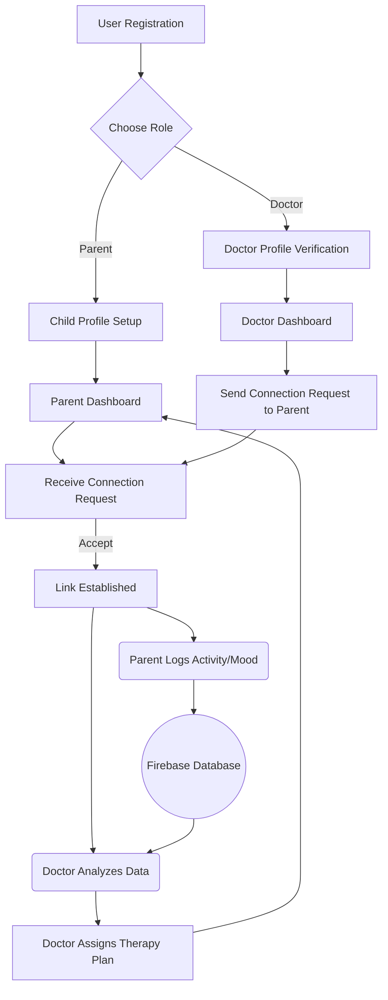

# CARE-AI: Hackathon Proposal

## 1. Brief about the Idea
**  ** is an AI-powered parenting companion and therapy assisting application designed specifically for children with neurodivergent conditions (such as Autism Spectrum Disorder, ADHD, and Speech Delays) and their caregivers. 

The purpose of CARE-AI is to bridge the gap between expensive, infrequent professional therapy and the daily developmental needs of the child at home. Often, parents feel overwhelmed, lacking the specialized training needed to consistently aid their child's development. CARE-AI provides real-time, personalized AI guidance, tracks daily progress securely, and connects parents directly to their professional therapists via a dedicated "Doctor Stream" for asynchronous supervision and plan adjustments.

## 2. How different is it from existing solutions?
Current solutions are highly fragmented. 
- **Standard Parenting Apps** focus on neurotypical milestones and lack the specialized nuance required for neurodivergent care. 
- **Professional Therapy Platforms** are often enterprise-focused (B2B clinics), expensive, and lack a child-friendly, engaging interface for the end-user. 
- **Standalone Games** lack proper tracking or practitioner oversight.

**CARE-AI** unifies these streams. It offers an engaging interface for the child (gamified therapy modules), a supportive dashboard for the parent (AI chatbot, resource library), and a dedicated portal for the therapist/doctor to review data and assign customized plans—all in one secure, unified ecosystem.

## 3. How will it solve the problem?
The system utilizes a dual-role application structure:
1.  **Parent/Child Stream:** Parents complete onboarding detailing their child’s specific needs. The AI generates a daily actionable plan (e.g., sensory exercises, speech games). Parents log activities, mood behaviors, and milestones.
2.  **Doctor Stream:** Therapists securely link to their patients. They access a dashboard showing timeline activity logs, milestone achievements, and AI-summarized progress reports. The therapist can remotely assign new therapy modules and send secure "Guidance Notes" to the parent, ensuring home therapy is medically aligned.

By making therapy continuous and data-driven at home, we reduce parental burnout and significantly improve intervention outcomes.

## 4. USP (Unique Selling Proposition)
**AI-Augmented, Clinician-Supervised Home Therapy.** 
Unlike AI tools that try to *replace* therapists, CARE-AI *empowers* them. Our USP is the seamless "Triad of Care" workflow—the AI handles daily micro-interactions and data synthesis, the parent handles execution, and the doctor retains supreme override and assignment authority, leading to safe, scalable, and personalized intervention.

## 5. List of Features
*   **Role-Based Access Control (RBAC):** Distinct UX/UI for Parents vs. Doctors.
*   **AI Chatbot Companion:** Context-aware assistant for parents to ask behavioral or developmental questions.
*   **Custom Daily Plans:** Auto-generated activities based on the child's profile and therapist overrides.
*   **Therapy Games Hub:** Gamified modules targeting Speech, Motor, Cognitive, and Social skills.
*   **Doctor Dashboard:** Centralized patient roster, progress graphs, and clinical analytics.
*   **Therapy Module Assignment:** Doctors can push specific tasks to a patient's daily plan.
*   **Secure Guidance Notes:** Asynchronous messaging from doctor to parent.
*   **Offline Data Persistence:** Ensuring accessibility in low-connectivity environments.

## 6. Process Flow Diagram



## 7. Wireframes / Mock Diagrams

**Parent Dashboard (Home)**
```text
---------------------------------
| [Menu]     CARE-AI    [Profile] |
|-------------------------------|
| Hello, Sarah!                 |
|                               |
| [⭐ Daily Plan: 3 Tasks]       |
|  - Speech Game (Assigned)     |
|  - Sensory Box (AI Suggest)   |
|                               |
| [💬 Talk to AI Assistant]       |
|                               |
| [🎮 Games] [📈 Progress]        |
|-------------------------------|
| 🔴 [EMERGENCY MELTDOWN MODE]  |
---------------------------------
```

**Doctor Dashboard (Patients)**
```text
---------------------------------
| [Menu]     Dr. Portal         |
|-------------------------------|
|  🔍 Search Patients...        |
|                               |
| [Patient: Liam, Age 4]        |
|  - ASD, Speech Delay          |
|  - Status: Active             |
|  [View Analytics] [Assign]    |
|                               |
| [Patient: Emma, Age 6]        |
|  - ADHD, Motor Delay          |
|  - Status: Needs Review       |
|  [View Analytics] [Assign]    |
---------------------------------
| 🏠 Home | 👥 Patients | ⚙️ Set |
---------------------------------
```

## 8. Architecture Diagram

```mermaid
graph LR
    subgraph Frontend [Flutter Application (Cross-Platform)]
        UI[UI/UX Components]
        State[State Management]
        Local[Local Cache/SQLite]
    end

    subgraph Backend [Firebase Platform]
        Auth[Firebase Auth - RBAC]
        DB[(Cloud Firestore)]
        Storage[Cloud Storage]
        Functions[Cloud Functions]
    end

    subgraph External APIs
        LLM[Google Gemini API]
    end

    UI <--> State
    State <--> Local
    State <--> DB
    State <--> Auth
    Functions <--> LLM
    DB --> Functions
```

## 9. Technologies to be Used
*   **Frontend Data & UI:** Flutter framework (Dart)
*   **Backend & Database:** Firebase (Cloud Firestore, Authentication, Storage)
*   **AI / LLM Integration:** Google Gemini API (for the conversational assistant and plan generation)
*   **State Management:** Provider / Riverpod (Flutter)
*   **Version Control:** Git & GitHub

## 10. Usage of AMD Products / Solutions
*(If deploying to an enterprise cloud or self-hosted scenario, adjust as needed. For typical serverless, this section focuses on cloud compute).*
*   **AMD EPYC™ Processors (Cloud Instances):** If deploying custom backend microservices (e.g., a Python FastAPI backend for heavier ML/AI data processing models outside of Gemini), we would utilize GCP N2D or AWS M6a instances powered by AMD EPYC processors. This ensures high-performance, cost-effective computational throughput for concurrent AI inference requests and large-scale patient analytics data aggregation.
*   **AMD Radeon™ Pro (Future Work - Local Edge AI):** Future iterations of the child's gamified modules could utilize local pose-estimation (tracking motor skills via camera). Leveraging AMD hardware acceleration on local devices (PCs/laptops) would allow real-time ML processing without compromising privacy by sending video feeds to the cloud.

## 11. Estimated Implementation Cost
**Phase 1 (MVP / Hackathon Scope) - 3 to 6 months:**
*   **Development Cost (Sweat Equity):** $0 (Built by the team)
*   **Infrastructure (Firebase Spark/Blaze):** ~$0 - $50/month.
*   **AI API Costs (Gemini/OpenAI):** ~$20 - $100/month (depending on user load).
*   **App Store Developer Fees:** $99/year (Apple), $25 one-time (Google Play).

**Phase 2 (Production Scale - Year 1):**
*   **Cloud Hosting & Database (AWS/GCP AMD Instances + Firebase):** ~$500 - $1000/month.
*   **Security & Compliance (HIPAA audits):** $5,000 - $10,000 (one time).
*   **Maintenance & Updates:** Handled internally.

## 12. Scalability and Social Impact
*   **Scalability:** Built on a NoSQL document database (Firestore), the system horizontally scales automatically. The stateless nature of the Flutter UI and AI API calls means handling 10 users or 10,000 users requires no architectural rewrite.
*   **Social Impact:** CARE-AI democratizes access to specialized therapeutic strategies, empowering low-income or geographically isolated families who face 6-12 month waitlists for professional developmental pediatricians.
